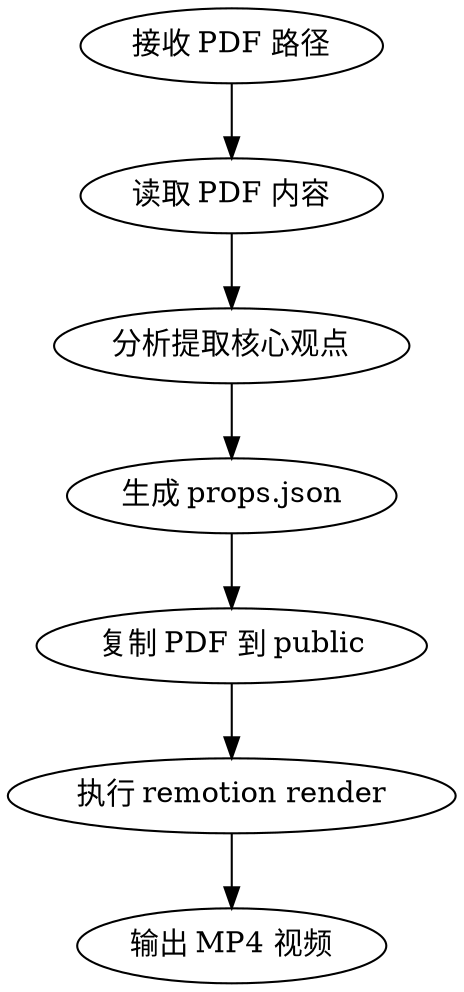

# PDF to Video

将 PDF 文档转换为展示视频，自动提取核心观点并生成动态展示。

## 工作流程



## 步骤详解

### 1. 读取 PDF 文件

使用 Read 工具读取用户提供的本地 PDF 文件路径。

### 2. 分析并提取核心观点

从 PDF 内容中识别：
- **标题**：文档主标题，通常在首页
- **副标题**：可选，如"核心内容概览"
- **核心观点**：3-5 个关键页面及其标题
- **内容描述**：每个关键页面的简要说明（1-2 句话），用于底部打字机效果展示

分析时关注：
- 章节标题和大纲
- 重点段落（加粗、高亮）
- 摘要和结论部分
- 图表和数据页面

### 3. 生成配置并渲染

**目录结构：**
```
props/           # 配置文件目录
  glm45.json     # 以文档名命名
  report-2024.json
out/             # 输出视频目录
  glm45.mp4
  report-2024.mp4
public/          # 源 PDF 文件
  document.pdf
```

**创建 `props/<name>.json`：**
```json
{
  "src": "/document.pdf",
  "title": "文档标题",
  "subtitle": "核心内容概览",
  "highlights": [1, 3, 7, 12, 15],
  "pageTitles": {
    "1": "封面",
    "3": "执行摘要",
    "7": "市场分析"
  },
  "pageDescriptions": {
    "1": "这是文档的封面页，展示了报告的主题和作者信息。",
    "3": "执行摘要概述了报告的核心发现和建议。",
    "7": "市场分析部分详细分析了当前市场趋势和竞争格局。"
  }
}
```

**执行命令：**
```bash
# 复制 PDF 到 public 目录
cp /path/to/source.pdf ./public/document.pdf

# 写入配置到 props 目录（使用 Write 工具）

# 渲染视频（配置和输出使用相同命名）
npx remotion render PdfShowcase out/<name>.mp4 --props=./props/<name>.json
```

## Props 参数说明

| 参数 | 类型 | 必填 | 说明 |
|------|------|------|------|
| `src` | `string` | 是 | PDF 文件路径，相对于 public 目录 |
| `title` | `string` | 否 | 主标题 |
| `subtitle` | `string` | 否 | 副标题 |
| `highlights` | `number[]` | 否 | 要聚焦展示的页码 |
| `pageTitles` | `Record<string, string>` | 否 | 每页的标题 |
| `pageDescriptions` | `Record<string, string>` | 否 | 每页的内容描述，底部打字机效果展示 |
| `script` | `ScriptItem[]` | 否 | 自定义脚本，完全控制展示流程 |

## 场景类型

可通过 `script` 参数使用不同的展示模式：

| 类型 | 说明 | 默认时长 |
|------|------|----------|
| `stack` | 卡片堆叠展示 | 60 帧 |
| `focus` | 聚焦放大某页 | 120 帧 |
| `switch` | 滑动切换 | 120 帧 |
| `fan` | 扇形轮盘展示 | 150 帧 |

**扇形模式示例：**
```json
{
  "script": [
    { "type": "stack", "duration": 60 },
    { "type": "fan", "page": 1, "duration": 150 },
    { "type": "fan", "page": 3, "duration": 150 },
    { "type": "stack", "duration": 120 }
  ]
}
```

## 输出

- 视频文件：`out/<name>.mp4`
- 格式：MP4
- 分辨率：1920x1080
- 帧率：30fps

## 示例交互

**用户：** 帮我把这个 PDF 转成展示视频：/Users/me/docs/report-2024.pdf

**执行：**
1. 读取 PDF 内容
2. 分析识别：标题"2024年度报告"，核心观点在第1、3、7、12、15页
3. 复制 PDF 到 `public/report-2024.pdf`
4. 生成配置 `props/report-2024.json`
5. 执行 `npx remotion render PdfShowcase out/report-2024.mp4 --props=./props/report-2024.json`
6. 告知用户视频已生成在 `out/report-2024.mp4`
